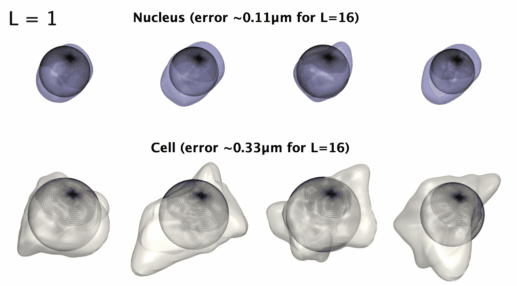
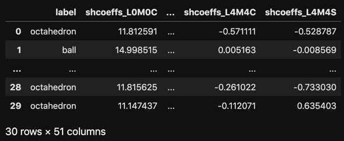
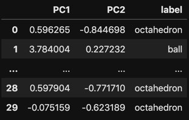
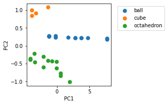

# AICS Spherical Hamonics Parametrization

[](https://github.com/AllenCell/aics-shparam/actions)
[](https://AllenCell.github.io/aics-shparam/)

### Spherical harmonics parametrization for 3D starlike shapes. 



## Installation:

**Stable Release**: `pip install aicsshparam`

**Build from source to make customization**: 

```console
git clone git@github.com:AllenCell/aics-shparam.git
cd aics-shparam
pip install -e .
```

## How to use

Here we outline an example of how one could use spherical harmonics coefficients as shape descriptors on a synthetic dataset composed by 3 different shapes: spheres, cubes and octahedrons.

```python
# Import required packages
import numpy as np
import pandas as pd
import matplotlib.pyplot as plt
from sklearn.decomposition import PCA
from aicsshparam import shtools, shparam
from skimage.morphology import ball, cube, octahedron
np.random.seed(42) # for reproducibility
```

```python
# Function that returns binary images containing one of the three
# shapes: cubes, spheres octahedrons of random sizes. 
def get_random_3d_shape():
    idx = np.random.choice([0, 1, 2], 1)[0]
    element = [ball, cube, octahedron][idx]
    label = ['ball', 'cube', 'octahedron'][idx]
    img = element(10 + int(10 * np.random.rand()))
    img = np.pad(img, ((1, 1), (1, 1), (1, 1)))
    img = img.reshape(1, *img.shape)
    # Rotate shapes to increase dataset variability.
    img = shtools.rotate_image_2d(
        image=img,
        angle=360 * np.random.rand()
    ).squeeze()
    return label, img

# Compute spherical harmonics coefficients of shape and store them
# in a pandas dataframe.
df_coeffs = pd.DataFrame([])
for i in range(30):
    # Get a random shape
    label, img = get_random_3d_shape()
    # Parameterize with L=4, which corresponds to50 coefficients
    # in total
    (coeffs, _), _ = shparam.get_shcoeffs(image=img, lmax=4)
    coeffs.update({'label': label})
    df_coeffs = df_coeffs.append(coeffs, ignore_index=True)
 
# Vizualize the resulting dataframe
with pd.option_context('display.max_rows', 5, 'display.max_columns', 5):
    display(df_coeffs)
```



```python
# Let's use PCA to reduce the dimensionality of the coefficients
# dataframe from 51 down to 2.
pca = PCA(n_components=2)
trans = pca.fit_transform(df_coeffs.drop(columns=['label']))
df_trans = pd.DataFrame(trans)
df_trans.columns = ['PC1', 'PC2']
df_trans['label'] = df_coeffs.label

# Vizualize the resulting dataframe
with pd.option_context('display.max_rows', 5, 'display.max_columns', 5):
    display(df_trans)
```



```python
# Scatter plot to show how similar shapes are grouped together.
fig, ax = plt.subplots(1,1, figsize=(3,3))
for label, df_label in df_trans.groupby('label'):
    ax.scatter(df_label.PC1, df_label.PC2, label=label, s=50)
plt.legend(loc='upper left', bbox_to_anchor=(1.05, 1))
plt.xlabel('PC1')
plt.ylabel('PC2')
plt.show()
```




## Reference

For an example of how this package was used to analyse a dataset of over 200k single-cell images at the Allen Institute for Cell Science, please check out our paper in [bioaRxiv](https://www.biorxiv.org/content/10.1101/2020.12.08.415562v1).

## Development
See [CONTRIBUTING.md](CONTRIBUTING.md) for information related to developing the code.


## Questions?

If you have any questions, feel free to leave a comment in our Allen Cell forum: [https://forum.allencell.org/](https://forum.allencell.org/). 


***Free software: Allen Institute Software License***